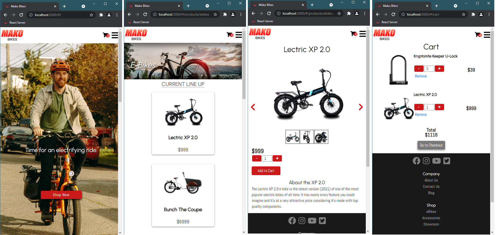

# Mako Bikes Shopping Page

**View Demo: https://datrinon.github.io/react-shopping-cart/**

## Features
- An e-commerce portal for fictitious e-bikes company Mako bikes.
- Features a home page, two categories of products, and a fully-functioning shopping cart (i.e. you can add items to it, modify their quantities, delete them, and see their quantity.)
- Utilizes a carousel slideshow to show off each product.

## Technical details
- Built with React (using `create-react-app`) using Hooks.
- Pathing done with React Router's Hash Router Feature (as it is purely front-end).
- Data drawn and enumerated from `.json` files mocking databases.

## Special Credits to...
- LectricXP Bikes' storefront.
- Specialized Bikes' storefront.